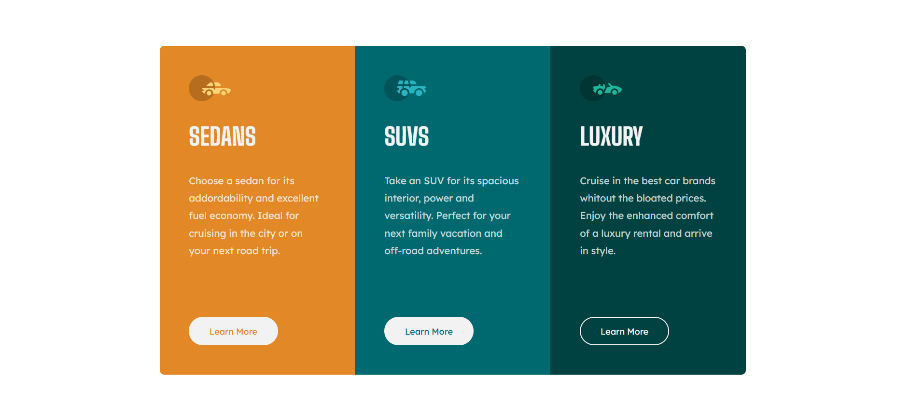

# Car Card
Tarjeta con información sobre tres tipos de autos, construida con HTML y CSS como practica de maquetación y aplicación de estilos.

## Preview


## Tecnologías utilizadas
- HTML5 (maquetación)
- CSS3 (estilos y propiedades)
- Google fonts (para la tipografía 'Lexend Deca' y 'Big Shoulders')

## Funcionalidades
- Flexbox para mantener el diseño responsive y controlar las posiciones de los elementos.
- Propiedad 'hover' sobre el boton para acceder a más información de cada auto.
- Utilización de variables en CSS para facilitar la reutilización de colores y tipografías.
- Interacciones solo con CSS (sin JavaScript).

## Instalación
1. Clonar el repositorio - copiar en la terminal de git: 
```
git clone https://github.com/mai-vr/practica-frontend.git
```
2. Abrir el navegador - Abrir el archivo 'index.html' en el navegador.