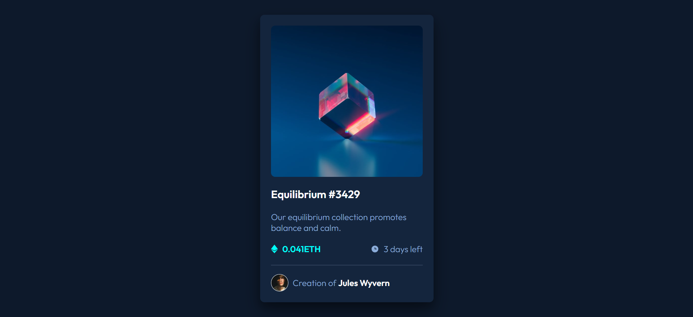

# NFT Card

Este proyecto es una tarjeta donde se pueden previsualizar los datos de un NFT. 
Fue construido con HTML y CSS como práctica de maquetación y aplicación de estilos.

## Preview


## Tecnologías utilizadas
- HTML5 (maquetación)
- CSS3 (estilos y propiedades)
- Google fonts (para la tipografía 'Outfit')

## Funcionalidades
- Flexbox para mantener el diseño responsive y controlar las posiciones de los elementos.
- Propiedad 'hover' sobre la imagen, título y nombre del autor.
- Utilización de variables en CSS para facilitar la reutilización de colores y tipografías.
- Interacciones solo con CSS (sin JavaScript).

## Instalación
1. Clonar el repositorio - copiar en la terminal de git: 
```
git clone https://github.com/mai-vr/practica-frontend.git
```
2. Abrir el navegador - Abrir el archivo 'index.html' en el navegador.