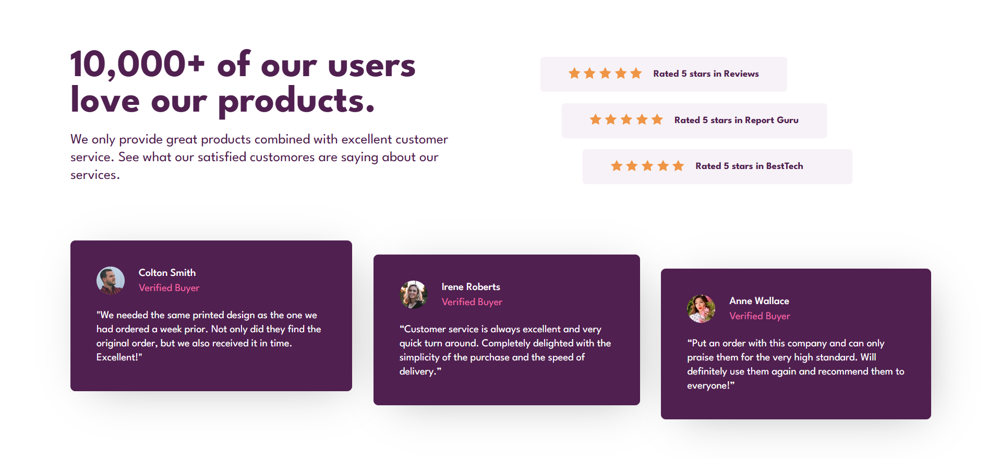

# Social Proof Section
Proyecto con reviews y opiniones sobre una empresa, maquetado con HTML y con la utilización de CSS para la aplicación de estilos.

## Preview


## Tecnologías utilizadas
- HTML5 (maquetación)
- CSS3 (estilos y propiedades)
- Google fonts (para la tipografía 'League Spartan')

## Funcionalidades
- Flexbox para mantener el diseño responsive y controlar las posiciones de los elementos.
- Utilización de variables en CSS para facilitar la reutilización de colores y tipografías.
- Diseño HTML claro y limpio con clases e identificadores.

## Instalación
1. Clonar el repositorio - copiar en la terminal de git: 
```
git clone https://github.com/mai-vr/practica-frontend.git
```
2. Abrir el navegador - Abrir el archivo 'index.html' en el navegador.